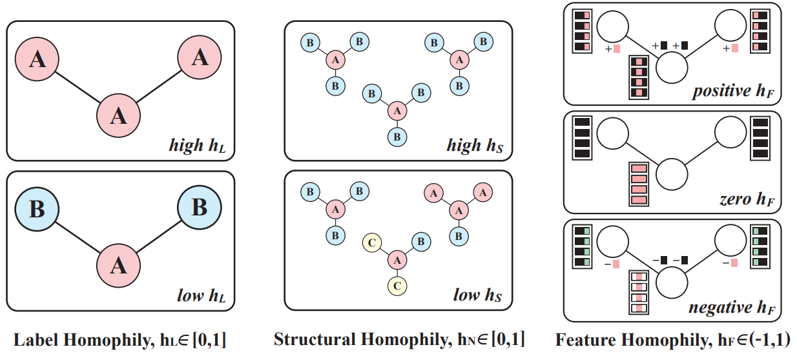
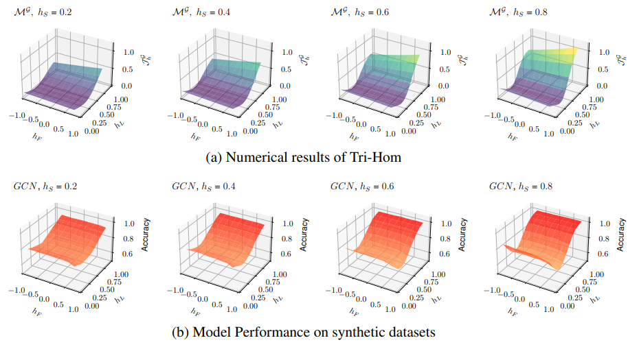
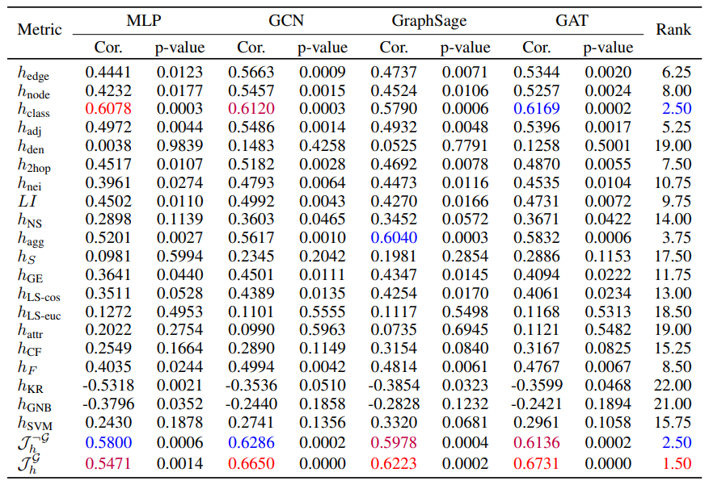
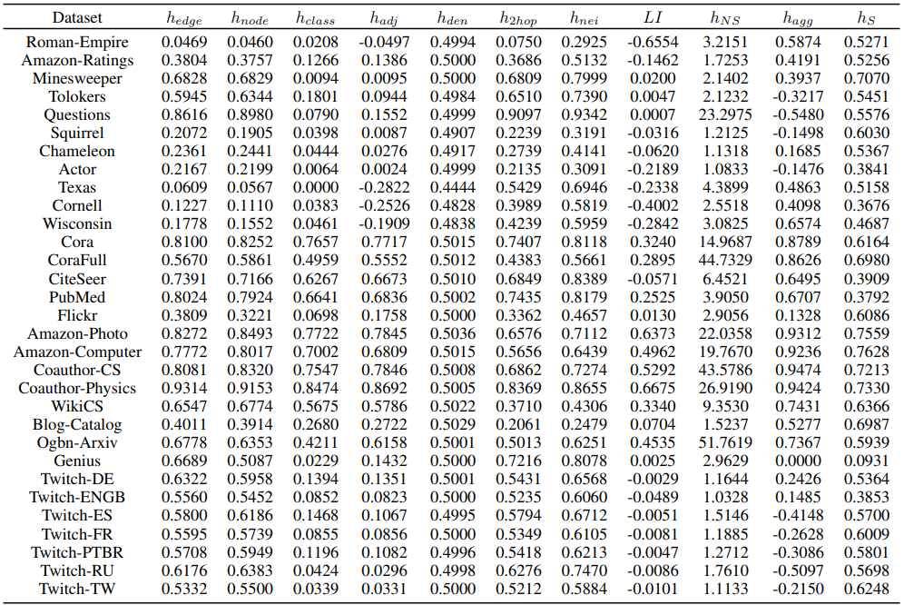
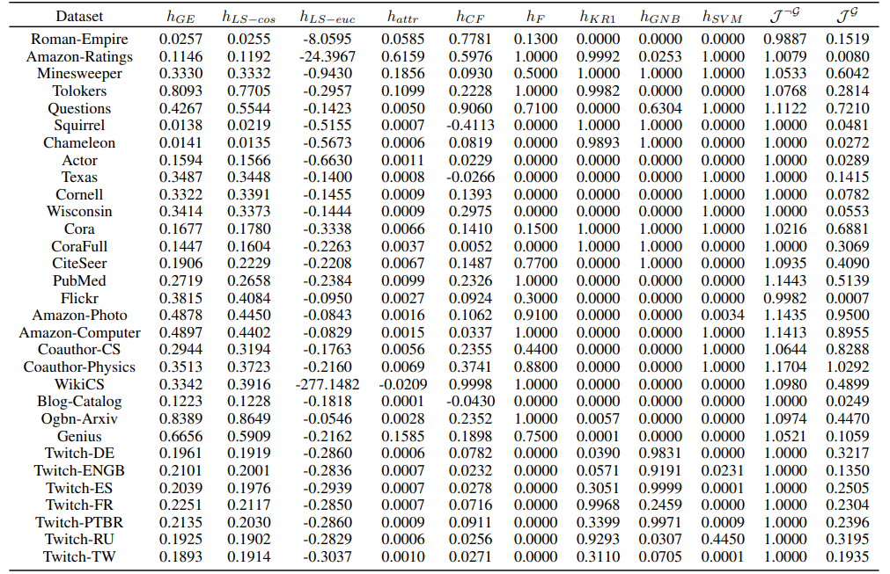

# What Is Missing For Graph Homophily? Disentangling Graph Homophily For Graph Neural Networks
Code Implementation for ["What Is Missing For Graph Homophily? Disentangling Graph Homophily For Graph Neural Networks"](https://arxiv.org/pdf/2406.18854v1)

Conventional homophily measurements only consider the label aspect, ignoring structural and feature aspects. This definition leads to confusing phenomena such as the mid-homophily "pitfall," "good" or "bad" homophily, and feature shuffling. In this paper, we fill the missing part by disentangling graph homophily into label, structural, and feature aspects. By considering these aspects collectively, we introduce the Tri-Hom metric based on CSBM-3H. Our proposed theorems effectively explain these confusing phenomena and aligns well with the performance of GNNs. The high correlation with GNN behavior on 31 real-world benchmark datasets confirms the superiority of Tri-Hom over 17 existing metrics.

#### Disentangled Homophily Definitions

<p align="center">
  
</p>

#### Tri-Hom

Tri-Hom for graph-agnostic models: $\mathcal{J}_h^{\neg\mathcal{G}}=\frac{1-(\frac{h_F}{\rho(\mathbf{A})})^2(C(\frac{1-h_L}{C-1})^2+C\frac{(1-h_S)^2}{C-1}+(\frac{h_L C-1}{C-1})^2)}{\left[1- (\frac{h_F}{\rho(\mathbf{A})}) (\frac{h_L C-1}{C-1})\right]^2}$, 

Tri-Hom for graph-aware models:  $\mathcal{J}_h^{\mathcal{G}}=\frac{(\frac{h_L C-1}{C-1})^2}{C(\frac{1-h_L}{C-1})^2+C\frac{(1-h_S)^2}{C-1}+(\frac{h_L C-1}{C-1})^2}\mathcal{J}_h^{\neg\mathcal{G}}$, where $h_L$, $h_S$, and $h_F$ refers to label homophily, structural homophily, and feature homophily respectively.

#### Synthetic Dataset Experiment: Performance on synthetic datasets align well with numerical results

<p align="center">
  
&nbsp; &nbsp; &nbsp; &nbsp;
  
</p>

#### Real-World Dataset Experiment: Tri-Hom achieves the highest correlation with 17 Homophily Measurements on 31 Datasets

<p align="center">
  
</p>

<p align="center">
  
  &nbsp; &nbsp; &nbsp; &nbsp;
  
</p>


## Overview
The repository is organised as follows:
```
| -- train.py # Main training framework
| -- config.py # Configurations and descriptions of hyper-parameters
| -- datasets.py # Dataset class and homophily metrics of label, structural, and feature homophily
| -- homophily.py # Additional homophily metrics
| -- preprocess_dataset.py # Preprocess real-world datasets
| -- utils.py # Some useful functions
| -- /data # Folder to place preprocessed datasets
| -- /experiments # Folder to save experimental results
```
## Environment

```
python==3.7.16
torch==1.12.0+cu116
torch-cluster==2.1.1
torch-geometric==2.3.1
torch-scatter==2.1.1
torch-sparse==2.1.1
torch-spline-conv==1.2.2
dgl==1.1.2+cu116
ogb==1.3.6
numpy==1.19.2
scipy==1.7.3
networkx==2.3
```

## Data Preparation
#### 1. Preprocessed datasets
Datasets of amazon-photo, amazon-computer, coauthor-cs, coauthor-physics, wikics, blog-catalog, ogbn-arxiv, genius, twitch-DE, twitch-ENGB, twitch-ES, twitch-FR, twitch-PTBR, twitch-RU, and twitch-TW are downloaded from preprocess_dataset.py
```
load_new_dataset(dataset_name=<DATASET_NAME>,split_type='random', train_prop=0.6, valid_prop=0.2, num_data_splits=10)
```

The preprocessed `<DATASET_NAME>.npz` file will be placed in `/data`

#### 2. Download datasets
Datasets of roman-empire, amazon-ratings, minesweeper, tolokers, questions, squirrel-filtered, chameleon-filtered, actor, texas-4-classes, cornell, and wisconsin are from https://github.com/yandex-research/heterophilous-graphs/tree/main/data.


Please download and put the preprocessed datasets in `/data`

## Training

For synthetic datasets, 
```
python train.py --dataset syn --model <MODEL NAME> --num_runs 1 --device <DEVICE> --save_dir <SAVED FILE DIR> --seed <RANDOM SEED> --syn_num_node <NUM OF NODES> --syn_num_class <NUM OF CLASS> --syn_num_degree "<MINIMUM NODE DEGREE> <MAXIMUM NODE DEGREE>" --syn_feat_dim <FEATURE DIMENSION> --syn_h_l <LABEL HOMOPHILY> --syn_h_s <STRUCTURAL HOMOPHILY> --syn_h_f <FEATURE HOMOPHILY> --num_steps <MAXIMUM TRAINING STEPS>
```

For real-world datasets,
```
python train.py --dataset <DATASET NAME> --model <MODEL NAME> --num_layers 2 --device <DEVICE> --save_dir <SAVED FILE DIR> --num_steps <MAXIMUM TRAINING STEPS> --hidden_dim <SIZE OF EMBEDDING> --dropout <DROPOUT RATE> --lr <LEARNING RATE>
```

For model hyper-parameters, please refer to config.py for detailed descriptions.

## Homophily Measurement

To measure the graph homophily, please run
```
python homophily_test.py --dataset <DATASET_NAME> --homophily_metric <HOMOPHILY>
```

where we support many types of graph homophily measurement, including
```
node_homo (node homophily)
edge_homo (edge homophily)
class_homo (class homophily)
node_hom_generalized (generalized node homophily)
agg_homo_soft (aggreation homophily with soft LAS)
agg_homo_hard (aggreation homophily with hard LAS)
adj_homo (adjusted homophily)
label_info (label informativeness)
kernel_reg0_based_homo (kernel based homophily with reg0)
kernel_reg1_based_homo (kernel based homophily with reg1)
gnb_based_homo (gnd-based homophily)
svm_based_homo (svm-based homophily)
cls_ctrl_feat_homo (class-controlled feature homophily)
attr_homo (attribute homophily)
den_homo (density-aware homophily)
localsim_cos_homo (Local Similarity homophily)
localsim_euc_homo (Local Similarity homophily)
two_hop_homo (2-hop Neighbor Class Similarity)
neibh_homo (2-hop Neighbor Class Similarity)
ccns (Cross-Class Neighbor Similarity)
```
and the newly proposed homophily measurements in our paper
```
h_s (Structural Homophily)
h_f (Feature Homophily)
```
## Attribution
Parts of the model training are based on https://github.com/yandex-research/heterophilous-graphs

Parts of the homophily metrics are based on https://github.com/SitaoLuan/When-Do-GNNs-Help

## License
MIT